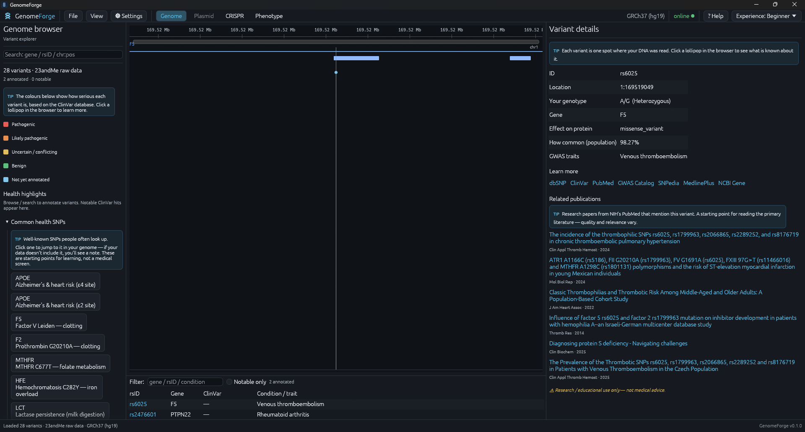
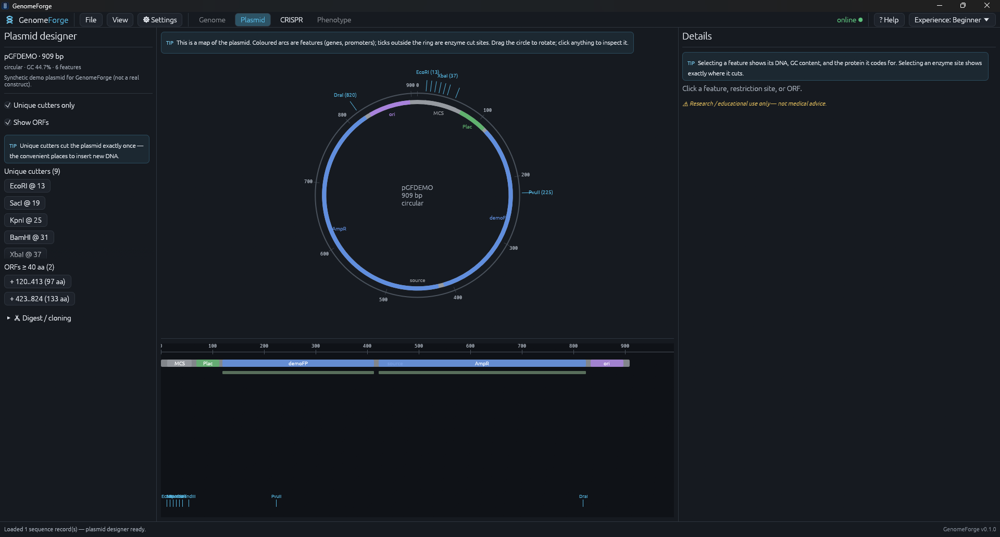

<div align="center">


# GenomeForge

### Your genome, on your machine.

**A professional-grade genomics workbench — genome browser, plasmid designer, CRISPR studio, and polygenic-risk modeling — that runs natively, works offline, and keeps your DNA private.**

[](https://github.com/ABowlOfEleven/genomeforge/actions/workflows/ci.yml)
[](https://github.com/ABowlOfEleven/genomeforge/actions/workflows/release.yml)
[](LICENSE)
[](#download)
[](https://www.rust-lang.org)

</div>

<p align="center">
  
</p>

GenomeForge brings the kind of tooling that used to live behind cloud platforms and paywalls into a
single fast, native app that runs entirely on your computer. Load a 23andMe export or a VCF and start
exploring in seconds — annotate variants against the major public databases, jump straight to
well-known health SNPs, read the primary literature — then step next door to design a plasmid or a
CRISPR edit. No account, no upload, no subscription.

## Why GenomeForge

- **Private by design.** Your raw genotypes never leave the machine. Only rsIDs and genomic regions are
  ever sent to public APIs, and an offline mode uses nothing but the local cache.
- **Native, not a web app.** Pure Rust and egui — a small, quick binary with no browser engine, no
  Electron, and no telemetry.
- **Four tools in one window.** A genome browser, a plasmid CAD, a CRISPR studio, and a polygenic-risk
  modeler, switchable from the top bar — no more stitching together half a dozen sites.
- **Approachable *and* professional.** A single dropdown retunes the entire interface from
  high-school-friendly to expert-dense, with a built-in tutorial in every section.
- **Free and open source.** MIT-licensed and multiplatform — Windows, Linux, and macOS.

> Research and educational use only — not medical advice.

## What's inside

Four workspaces share one window, switchable from the top bar.

| Workspace | What it does |
|-----------|--------------|
| **Genome browser & variant explorer** | Import 23andMe / AncestryDNA, VCF, FASTA, or GenBank. Variants are drawn as lollipops coloured by ClinVar significance and annotated against ClinVar, gnomAD, and dbSNP (via MyVariant.info). One-click quick-jumps to common health SNPs, a filterable variant table you can export to CSV, GRCh37 ⇄ GRCh38 liftover, and a per-variant deep dive with links to dbSNP, ClinVar, GWAS Catalog, gnomAD, MedlinePlus, and a live PubMed search. |
| **Plasmid designer** | Circular and linear maps, restriction-site mapping with unique-cutter highlighting, ORF detection and translation, primer Tm / GC, a digest / cloning preview with a mini gel, and Golden-Gate / Gibson assembly simulation. |
| **CRISPR studio** | Guide design across SpCas9, SpCas9-NG, SpRY, and Cas12a, with a real Doench 2014 on-target model, CFD off-target scoring (against the target or a loaded reference genome), NHEJ / HDR edit simulation, base- and prime-editing previews, and an AAV cargo planner. |
| **Phenotype & risk** | Polygenic scores from the PGS Catalog applied to your genome — with coverage, an ancestry caveat, and the Mendelian / ClinVar findings that can matter on their own. |

Open files by drag-and-drop or **File ▸ Open Recent**, copy sequences and IDs to the clipboard, and
let the app check for new releases on launch.

<p align="center">
  
</p>

## Built for every level

A dropdown in every workspace retunes the whole interface, and each section has a short built-in
tutorial:

- **Beginner** — plain language and guided, written for a student or the simply curious.
- **Intermediate** — the same, plus the numbers and what they mean.
- **Expert** — dense and complete, for biologists and genomics professionals.

## Download

Grab the latest build for your platform from the [**Releases**](https://github.com/ABowlOfEleven/genomeforge/releases) page:

| Platform | Files |
|----------|-------|
| **Windows** | `GenomeForge-<version>-x64.msi` (installer) or the portable `.exe` |
| **Linux** | `.tar.gz` (portable binary) or a Flatpak bundle |
| **macOS** | universal `.dmg` (Intel + Apple Silicon) — unsigned, so right-click then Open the first time |

## Build from source

GenomeForge is a pure-Rust workspace. With a recent stable toolchain:

```sh
cargo run -p gx-app                                       # launch
cargo run -p gx-app -- assets/sample_genome_23andme.txt   # open a demo genome
cargo test --workspace                                    # run the tests
```

Per-platform packaging (Windows MSI, Linux Flatpak, macOS `.dmg`) is documented in
[BUILD.md](BUILD.md).

## How it works

A Cargo workspace of small, focused crates:

| Crate | Responsibility |
|-------|----------------|
| `gx-core` | Domain model — assemblies, ranges, variants, features |
| `gx-io` | Importers: raw DNA, VCF, FASTA / GenBank |
| `gx-annotate` | Hybrid online + cached annotation (MyVariant, Ensembl, PGS Catalog, PubMed) over a local cache |
| `gx-plasmid` | Restriction mapping, ORFs, primers, digest / cloning |
| `gx-crispr` | Guide design, Doench / CFD scoring, edit simulation, AAV planning |
| `gx-pgs` | PGS Catalog parsing and scoring |
| `gx-app` | The eframe (egui) desktop application |

Built with [egui / eframe](https://github.com/emilk/egui), [noodles](https://github.com/zaeleus/noodles),
[gb-io](https://github.com/dlesl/gb-io), and [redb](https://github.com/cberner/redb). Every network and
disk operation runs on a background thread, so the interface never blocks.

## Privacy

- Raw genotypes stay on your machine; only rsIDs and regions are sent to annotation APIs.
- An offline toggle disables all network access and renders from the local cache.
- Annotations are cached locally for fast, offline reuse.

## License

[MIT](LICENSE) — © GenomeForge contributors.

Scoring methods (Doench on-target, CFD off-target, PGS percentiles) are transparent, documented
decision-support estimates, not a clinical pipeline. GenomeForge is for learning, research, and design
exploration — not medical advice.
